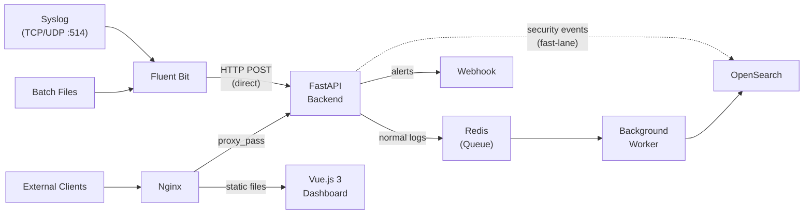

# Full-Stack Log Management Demo

A complete, production-ready Log Management solution designed for both **Appliance (Docker Compose)** and **SaaS/Cloud** deployments. It robustly ingests, normalizes, stores, queries, and visualizes log data from diverse sources while maintaining strict multi-tenant data isolation and role-based access control.

## 🏗 Architecture & Tech Stack

- **Ingestion:** Fluent Bit (Syslog UDP/TCP, File Batch) & FastAPI (HTTP POST/JSON)
- **Message Queue:** Redis (Buffers logs to prevent OpenSearch bottlenecks)
- **Normalization:** Pydantic Models (Backend) & Fluent Bit Parsers
- **Storage/Search:** OpenSearch (Time-series optimized indexing)
- **Backend API:** FastAPI (JWT Auth, Webhooks, Rate Limiting, OpenSearch bindings)
- **Frontend UI:** Vue.js 3 + Vite, styled with Tailwind CSS
- **Web Server / Proxy:** Nginx (with TLS support for SaaS)
- **Infrastructure:** Docker & Docker Compose (Appliance & SaaS modes)

### Data Flow Overview


---

## ✨ Key Features Implemented

1. **Multi-Source Ingestion:** Supports real Syslog, JSON REST API, and File Batch ingestion. Tested with 5 distinct log profiles (Firewall, API, CrowdStrike, AWS, M365).
2. **Unified Common Schema:** Normalizes disparate logs into a standard schema structure.
3. **Multi-Tenant Isolation & RBAC:** Data is physically separated in OpenSearch by `tenant`. Role-Based Access Control limits viewers to their own tenant's data.
4. **Alerting System & Webhooks:** Background worker detects failed logins, registers alerts on the dashboard, and pushes notifications via external Webhooks (e.g., Discord/Slack).
5. **DDoS Protection & Queueing:** Implements API Rate Limiting (100 req/min) via `slowapi` and uses **Redis** as a Message Queue to buffer high-volume log ingestion.
6. **GeoIP Enrichment:** Automatically enriches incoming logs with GeoIP lookup (country mapping) during the worker ingestion phase using `ip-api` with in-memory caching.
7. **Modern Dashboard:** Real-time SPA featuring timeline visualization (Chart.js), Top IP/Users/Events, and sortable recent log lists.
8. **Log Retention (7 Days):** Automated Index State Management (ISM) script to enforce a 7-day data retention policy.
9. **CI/CD Pipeline:** Fully configured GitHub Actions workflow (`.github/workflows/test.yml`) for automated pytest validation on push.

---

## ⚙️ Prerequisites

To run this project locally, ensure you have:
- **Docker** and **Docker Compose**
- **Python 3.8+** (for running tests and log simulation scripts)

---

## 🚀 Quick Start (Appliance Mode)

We have provided automated scripts to configure the environment, boot the containers, and ingest sample logs.

**For Windows (PowerShell or CMD):**
```cmd
.\start_demo.bat
```

**For Linux / macOS:**
```bash
./start_demo.sh
```

**Manual Start:**
1. Copy the environment template: `cp .env.example .env`
2. Start the infrastructure: `docker-compose up -d --build`
3. Initialize the 7-day retention policy: `./init_retention.sh`

---

## ☁️ Quick Start (SaaS Mode with HTTPS)

To test the SaaS deployment with TLS enabled:
1. Generate self-signed certificates: `bash generate_certs.sh`
2. Start the SaaS infrastructure: `docker-compose -f docker-compose.saas.yml up -d --build`
3. Access the dashboard via **https://localhost** (accepting the self-signed warning).

---

## 📊 Using the Dashboard

Once the containers are running, navigate to: **[http://localhost](http://localhost)**

You can log in using the following demonstration accounts:

| Username | Password | Role | Tenant Access |
|----------|----------|------|---------------|
| `admin` | `admin123` | Super Admin | All tenants |
| `viewerA` | `viewer123` | Tenant Viewer | `demoA` only |
| `viewerB` | `viewer123` | Tenant Viewer | `demoB` only |

---

## 🧪 Generating Test Data

We provide a Python simulator script that mimics 5 different data sources and pushes them directly to the backend API.

To simulate log ingestion, open another terminal and run:
```bash
# Push 50 random logs to the system
python samples/post_logs.py

# Trigger a Brute Force Attack alert (3 failed logins from same IP)
python samples/trigger_alert.py
```
*After running, return to the Dashboard and click **Refresh** to see the new data and potential alerts.*

---

## 📖 Documentation Directory

For deeper technical details, please refer to the `/docs/` folder:
- **[System Architecture](docs/architecture.md)**: Data flow diagrams and tenant models.
- **[Appliance Setup](docs/setup_appliance.md)**: Detailed instructions for local/VM Docker Compose deployment.
- **[SaaS Setup](docs/setup_saas.md)**: Cloud deployment instructions including Nginx TLS configuration.

---

## 🛡 Testing

A testing suite for the backend APIs using `pytest` and `FastAPI TestClient` is available.
```bash
pip install -r backend/requirements.txt
pip install pytest
pytest tests/
```

---

## 🛠 Troubleshooting

**1. OpenSearch container exits immediately (code 78)**
OpenSearch requires the host's virtual memory to be increased. 
- **Linux:** Run `sudo sysctl -w vm.max_map_count=262144` (handled automatically by `start_demo.sh`).
- **Windows / Docker Desktop:** Usually handled automatically by the WSL2 backend. If it still fails, you may need to configure `.wslconfig` to increase memory limits.

**2. Missing Retention Policy on Windows**
If you run `start_demo.bat`, the 7-day retention policy (`init_retention.sh`) is not automatically applied because Windows CMD cannot natively run bash scripts. To apply it, open Git Bash or WSL and run `bash init_retention.sh` manually.