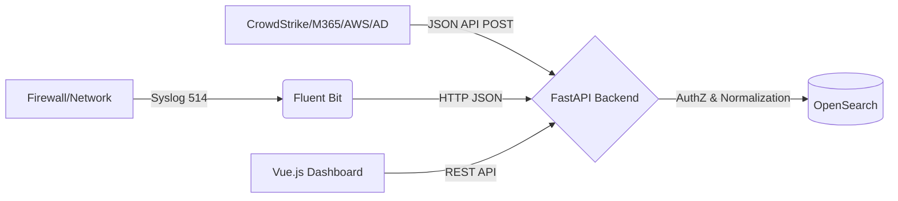

# System Architecture

## Overview
This system is a full-stack Log Management solution designed to securely ingest, normalize, store, search, and visualize event logs from multiple sources.

## Data Flow

## Component Architecture
1. **Collector / Ingest Layer (Fluent Bit):** Listens for Syslog data on ports 514 (TCP/UDP), extracts key-value pairs, normalizes them, and forwards the JSON payload to the FastAPI backend with an Ingestion Token.
2. **Backend API (FastAPI):** Exposes `/ingest` for receiving logs, `/token` for OAuth2 authentication, and `/search` for querying. It normalizes events to a Common Schema and handles Multi-tenant routing.
3. **Storage & Index Layer (OpenSearch):** Stores JSON logs. Indices are separated dynamically by tenant and date (`logs-{tenant}-{YYYY.MM.DD}`).
4. **UI/Dashboard (Vue.js + Tailwind CSS):** A responsive Single Page Application offering data visualization using Chart.js.

## Multi-tenant Data Model
- **Ingestion:** When data arrives via API, the `tenant` field in the payload must match the authenticated user's assigned tenant (unless they are a super admin or using a master ingest token).
- **Storage:** OpenSearch creates separate indices per tenant (e.g., `logs-demoa-2025.08.20`). This physical separation ensures data cannot accidentally leak across tenants in a single search request.
- **Querying:** When a user searches, the FastAPI backend inspects the JWT token. If the user is assigned to `demoA`, the backend forces the OpenSearch query to target `logs-demoa-*` regardless of the user's input parameters.
