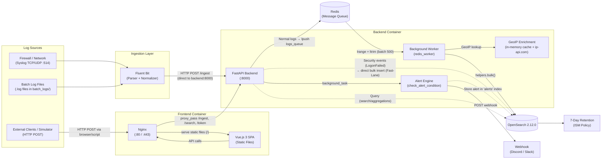

# System Architecture

## Overview
This system is a full-stack Log Management solution designed to securely ingest, normalize, store, search, and visualize event logs from multiple sources.

## Data Flow

## Component Architecture

1. **Frontend & Web Server (Nginx + Vue.js 3):** Nginx serves two roles: (a) serving the Vue.js 3 Single Page Application as static files, and (b) acting as a reverse proxy that forwards API requests (`/ingest`, `/search`, `/token`) to the FastAPI backend. In SaaS mode, it additionally handles TLS termination (HTTPS on port 443 with HTTP→HTTPS redirect).

2. **Collector / Ingest Layer (Fluent Bit):** Collects logs from three sources:
   - **Syslog** (TCP/UDP on port 514) — receives real-time network/firewall events
   - **Batch Files** (tail plugin) — reads `.log` files from the `batch_logs/` directory
   
   Fluent Bit applies parsers (key-value extraction), normalizes field names to the common schema via modify filters, adds RFC3339 timestamps, and forwards the JSON payload **directly** to the FastAPI backend at `backend:8000/ingest` (not through Nginx).

3. **Backend API (FastAPI):** Exposes three endpoints:
   - `POST /ingest` — receives logs (with JWT or static token auth), routes them to Redis queue or directly to OpenSearch (security events fast-lane)
   - `POST /token` — OAuth2 password flow for JWT authentication
   - `GET /search` — queries OpenSearch with aggregations for the dashboard
   
   Implements Rate Limiting (100 req/min via `slowapi`) to prevent DDoS attacks. Also triggers alert checks as background tasks.

4. **Message Queue (Redis):** A single Redis instance (`redis:alpine`) buffers normal incoming log data in a list (`logs_queue`) before it is indexed, preventing OpenSearch from becoming a bottleneck during traffic spikes. Security events (e.g., `LogonFailed`) bypass this queue for instant alerting via a fast-lane path.

5. **Background Workers:**
   - **Redis Worker (`redis_worker`):** An async background task started at application startup. It polls the Redis queue every 2 seconds, dequeues up to 500 logs per batch, enriches them with GeoIP data, and bulk-inserts them into OpenSearch.
   - **GeoIP Enrichment:** Maps source IPs to countries using `ip-api.com` (free tier, 45 req/min) with an **in-memory Python dict** (`geo_cache`) for caching. Private IPs (192.168.x, 10.x, 127.0.0.1) are labeled as "Internal".
   - **Alert Engine (`check_alert_condition`):** Checks for brute force patterns (≥3 failed logins from the same IP within 5 minutes). When triggered, stores an alert in a dedicated `alerts` index and sends a notification via external Webhook (Discord/Slack).

6. **Storage & Index Layer (OpenSearch 2.12.0):** Stores JSON logs with indices separated dynamically by tenant and date (`logs-{tenant}-{YYYY.MM.DD}`). An Index State Management (ISM) policy (applied via `init_retention.sh`) enforces a 7-day data retention limit. Alerts are stored in a separate `alerts` index.

7. **UI/Dashboard (Vue.js 3 + Tailwind CSS + Chart.js):** A responsive Single Page Application featuring timeline visualization (hourly/daily histograms via Chart.js), Top IPs/Users/Events aggregations, sortable recent log lists, and an alerting panel. Supports multi-tenant views with role-based filtering.

## Multi-tenant Data Model
- **Ingestion:** When data arrives via API, the `tenant` field in the payload must match the authenticated user's assigned tenant (unless they are a super admin with `tenant: "all"` or using the static `INGEST_TOKEN` for service accounts like Fluent Bit).
- **Storage:** OpenSearch creates separate indices per tenant (e.g., `logs-demoa-2025.08.20`). This physical separation ensures data cannot accidentally leak across tenants in a single search request.
- **Querying:** When a user searches, the FastAPI backend inspects the JWT token. If the user is assigned to `demoA`, the backend forces the OpenSearch query to target `logs-demoa-*` regardless of the user's input parameters. Super admins (`tenant: "all"`) can query across all tenants using `logs-*`.

## Authentication Model
- **JWT (JSON Web Tokens):** Users authenticate via `POST /token` with username/password. The backend returns a JWT containing `sub` (username), `role`, and `tenant` claims, valid for 24 hours.
- **Static Ingest Token:** Fluent Bit uses a static `INGEST_TOKEN` (configured via `.env`) as a Bearer token. The backend recognizes this token and authenticates as the `fluentbit` service account with `tenant: "all"`.
- **Demo Accounts:**
  | Username | Password | Role | Tenant Access |
  |----------|----------|------|---------------|
  | `admin` | `admin123` | Admin | All tenants |
  | `viewerA` | `viewer123` | Viewer | `demoA` only |
  | `viewerB` | `viewer123` | Viewer | `demoB` only |
  | `fluentbit` | (INGEST_TOKEN) | Service | All tenants |
