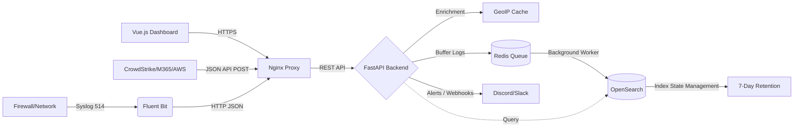

# System Architecture

## Overview
This system is a full-stack Log Management solution designed to securely ingest, normalize, store, search, and visualize event logs from multiple sources.

## Data Flow

## Component Architecture
1. **Web Server / Proxy (Nginx):** Acts as a reverse proxy managing incoming HTTP/HTTPS requests, handling TLS termination for the SaaS deployment mode, and routing traffic to the backend or frontend.
2. **Collector / Ingest Layer (Fluent Bit):** Listens for Syslog data on ports 514 (TCP/UDP), extracts key-value pairs, normalizes them, and forwards the JSON payload to the FastAPI backend.
3. **Backend API (FastAPI):** Exposes `/ingest` for receiving logs, `/token` for OAuth2 authentication, and `/search` for querying. It implements Rate Limiting (via `slowapi`) to prevent DDoS attacks.
4. **Message Queue (Redis):** Buffers high-volume incoming log data from the API before it is indexed, preventing OpenSearch from becoming a bottleneck during traffic spikes.
5. **Background Workers (GeoIP & Alerts):** 
   - **GeoIP Enrichment:** Automatically maps incoming IPs to countries using an in-memory cache.
   - **Alerting Engine:** Scans logs for patterns (e.g., Brute Force attacks) and triggers external Webhooks (Slack, Discord).
6. **Storage & Index Layer (OpenSearch):** Stores JSON logs. Indices are separated dynamically by tenant and date (`logs-{tenant}-{YYYY.MM.DD}`). An Index State Management (ISM) policy enforces a 7-day data retention limit.
7. **UI/Dashboard (Vue.js 3 + Tailwind CSS):** A responsive Single Page Application offering real-time data visualization (Chart.js) and log querying.

## Multi-tenant Data Model
- **Ingestion:** When data arrives via API, the `tenant` field in the payload must match the authenticated user's assigned tenant (unless they are a super admin or using a master ingest token).
- **Storage:** OpenSearch creates separate indices per tenant (e.g., `logs-demoa-2025.08.20`). This physical separation ensures data cannot accidentally leak across tenants in a single search request.
- **Querying:** When a user searches, the FastAPI backend inspects the JWT token. If the user is assigned to `demoA`, the backend forces the OpenSearch query to target `logs-demoa-*` regardless of the user's input parameters.
